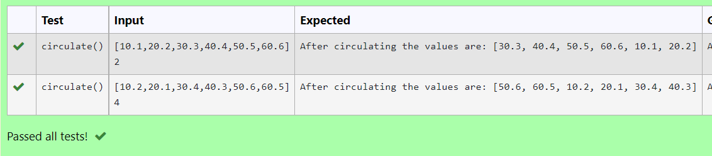

# Circulate-the-values-of-N-variables
## Aim:
To write a python program to circulate the n variables using function concept
## Equipment’s required:
PC
Anaconda - Python 3.7
## Algorithm: 
### Step 1:
 Get the two values from the user
### Step 2: 
Get the value from the user for the number of rotation
### Step 3:
Using the slicing concept rotate the list

### Step 4:
End the program

## Program:
```
Circulate the values of n variables
Name: Barath S
Register no: 22008643
```
```python
def circulate():
    a = eval(input())
    x = int(input())
    print("After circulating the values are: {}".format(a[x:]+a[:x]))
```
## Output:


## Result:
Hence a python program to circulate the n variables using function concept has written successfully.
